<!-- ═══════════════════════ CUSTOM HERO (hand-built SVG, not a generator) ═══════════════════════ -->

 

  

<!-- clickable nav -->
<a href="#-about-me">About</a> ·
<a href="#-github-analytics">Stats</a> ·
<a href="#-featured-projects">Projects</a> ·
<a href="#-tech-stack">Stack</a> ·
<a href="#-journey">Journey</a> ·
<a href="#-connect">Connect</a>

 

---

<h3 id="-about-me" align="center">🧑‍💻 About Me</h3>

<!-- custom animated terminal SVG — types itself out -->

 

<b>🎯 Quick facts — click to expand</b>

 

| | |
|---|---|
| 📍 **Based in** | India |
| 🧩 **Currently building** | Scalable full-stack applications |
| 🌱 **Currently learning** | Advanced System Design · Cloud/DevOps · ML fundamentals |
| 👯 **Open to collaborate on** | Dev tools · Open-source libraries · Creative web apps |
| 💬 **Ask me about** | Java, Python, C++, full-stack dev, Git workflows |
| ⚡ **Fun fact** | I write more code than documentation... wait, this **is** documentation 🤣 |

 

---

<h3 id="-github-analytics" align="center">📊 GitHub Analytics</h3>

 

<b>🧠 See language breakdown & trophy case — click to expand</b>

 

 

---

<h3 id="-featured-projects" align="center">🚀 Featured Projects</h3>

<b>🌐 Project One</b> — one-line tagline of what it does

 

`React` · `Node.js` · `MongoDB`

What it does, the problem it solves, and one standout technical detail worth mentioning.

<b>⚙️ Project Two</b> — one-line tagline of what it does

 

`Java` · `Spring Boot` · `PostgreSQL`

What it does, the problem it solves, and one standout technical detail worth mentioning.

<b>🧩 Project Three</b> — one-line tagline of what it does

 

`Python` · `Flask` · `Redis`

What it does, the problem it solves, and one standout technical detail worth mentioning.

<b>📱 Project Four</b> — one-line tagline of what it does

 

`TypeScript` · `Next.js` · `Tailwind`

What it does, the problem it solves, and one standout technical detail worth mentioning.

<i>Click each project to expand. Swap REPO_NAME / taglines / badges for your real pinned repos.</i>

 

---

<h3 id="-tech-stack" align="center">⚡ Tech Stack</h3>

 

---

<h3 id="-journey" align="center">🗺️ Journey</h3>

<b>2024 — Present</b> · 🚀 Building full-stack apps, exploring system design & cloud

 
Add specifics here — what you shipped, what you're currently working on.

<b>2023 — 2024</b> · 🌱 Deepened backend skills — Java, Spring Boot, databases

 
Add specifics here — a job, an internship, a big project.

<b>2022 — 2023</b> · 💻 Started open source contributions & personal projects

 
Add specifics here — first PR merged, first side project shipped.

<b>20XX</b> · 🎓 Wrote my first "Hello, World!"

 
Add specifics here — how you got started.

 

---

<h3 align="center">🏅 Certifications & Achievements</h3>

 

---

<h3 id="-connect" align="center">📬 Connect</h3>

  

 

<!-- CUSTOM FOOTER (hand-built SVG, matches hero) -->

